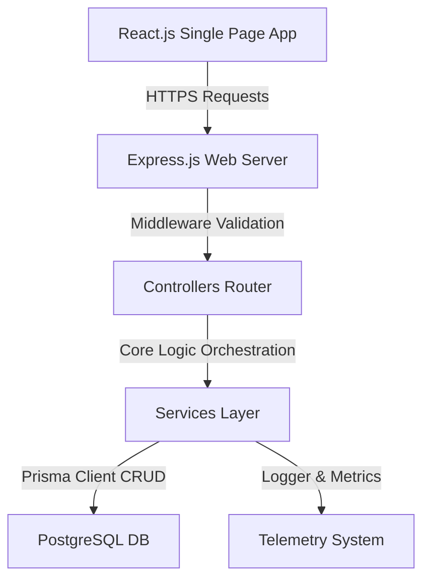

# Technical Project Documentation - eventhub360

This document outlines the detailed system architecture, module definitions, database design schema, API endpoints catalog, deployment configurations, and verification guide.

---

## 1. Project Overview

eventhub360 is an enterprise employee profile register and operations tracking software. It manages employee files, corporate assets inventory, leaves approvals queue, system diagnostic telemetry, and immutable transaction audit logs.

### Key Modules
1. **User Authentication & Role-Based Control:** Verification link mail simulation, JWT authorization, profile inspection, and customized navigation menu visibility (Admin, Manager, HR, and Employee).
2. **Employee Directory:** Detailed records containing designation, salary, phone number, address, professional skills assignments, and multi-file document upload storage.
3. **Asset Inventory Tracker:** Equipment catalog (laptop, keycards, monitor licenses) tracking status, purchase value, history trail logs, and allocation/return timelines.
4. **Leave Approval Panel:** Normalized leaves category, balances tracker, application requests queue with direct approval or rejection with feedback reasons.
5. **System Telemetry & Health Dashboard:** Server CPU memory statistics, traffic requests counter, database connection diagnostics, and Registered user quantities.
6. **Immutable Audit Trails:** Record deletions, updates, creations with structured JSON old vs. new values comparisons.
7. **SaaS Reporting Engine:** Excel workbook builder, CSV sheet exporter, high-fidelity PDF print outputs, and server-side multi-variable filters.

---

## 2. Architecture & Design

- **Frontend:** Single-page architecture powered by React, Vite, and Redux Toolkit state storage. Custom styling written in modular Vanilla CSS with responsive CSS grids.
- **Backend:** Upgraded controller-service-repository abstraction separating HTTP routing, business calculations, and database access.
- **Database:** Normalized database tables with foreign key constraints, indexes on lookup parameters, and Joi model validation.

---

## 3. Database Schema Design

The PostgreSQL database is defined and modeled using Prisma ORM.

### Models Overview
- **`User` (`users` table):** Tracks authentication credentials, system roles (admin, manager, hr, user), email verification state, and timestamps.
- **`EmployeeProfile` (`employee_profiles` table):** Links system users to business roles, department, salary, residential address, designation, and relations.
- **`EmployeeImage` (`employee_images` table):** Holds file links to employee credentials (Resume, ID cards).
- **`Department` (`departments` table):** Departments registry.
- **`Skill` / `EmployeeSkill`:** Tagged skills mapping.
- **`LeaveType` / `LeaveBalance` / `LeaveApplication`:** Tracks vacation definitions, available balances per year, and application status.
- **`Asset` / `AssetAllocation` / `AssetHistory`:** Tracks inventory hardware and active distribution.
- **`Notification`:** Broadcast messages.
- **`AuditLog` (`audit_logs` table):** Stores immutable snapshots of changed entries.

---

## 4. API Endpoints Catalog

### Authentication (`/api/v1/auth`)
- `POST /signup` - Register a new account.
- `POST /login` - Sign in and receive JWT and refresh tokens.
- `POST /logout` - Revoke active refresh token.
- `POST /refresh-token` - Request a new JWT access token.
- `GET /verify/:token` - Confirm registration.

### Employee Directory (`/api/v1/employees`)
- `GET /` - List/filter employee profiles.
- `POST /` - Register a new profile.
- `GET /:id` - Get employee profile details.
- `PUT /:id` - Update designation, department, skills.
- `DELETE /:id` - Terminate employee records.
- `POST /upload` - Multipart endpoint for document attachment.

### Leave Applications (`/api/v1/leaves`)
- `GET /my-requests` - User's own vacation requests history.
- `POST /` - File a new leave application.
- `GET /pending` - Approvers list of pending requests.
- `PUT /:id/approve` - Approve request and deduct balance.
- `PUT /:id/reject` - Reject request with feedback notes.

### Asset Inventory (`/api/v1/assets`)
- `GET /` - List inventory status.
- `POST /` - Register new asset item.
- `POST /allocate` - Assign device to employee.
- `POST /return` - Revoke asset assignment.

### Telemetry & Audits (`/api/v1`)
- `GET /health` - System diagnostics and ping check.
- `GET /audit-logs` - System telemetry change logs.

---

## 5. Deployment Configurations

### Cloud Database (Neon PostgreSQL)
1. Set database provider to PostgreSQL.
2. Initialize migration: `npx prisma db push`.

### Backend Service (Render Web Service)
- **Repo:** Linked GitHub Repository
- **Environment:** Node.js
- **Build Command:** `npm install`
- **Start Command:** `npm start`
- **Variables:**
  - `DATABASE_URL` (connection string)
  - `JWT_SECRET` (signature key)
  - `NODE_ENV=production`

### Frontend Application (Vercel SPA Hosting)
- **Framework Preset:** Vite
- **Root Directory:** `frontend/`
- **Build Command:** `npm run build`
- **Output Directory:** `dist`
- **Variables:**
  - `VITE_API_URL` (deployed render backend endpoint with `/api`)

---

## 6. Screenshots Guide

Ensure to capture these screens for final review:
1. **Welcome Login Screen** (Light UI theme)
2. **Main Telemetry Dashboard** (Department pie chart, assets counts bar graph, salary values)
3. **Employee Register Profile** (Multi-select checkbox list, files uploader form)
4. **Leave Approvals Modal** (Manager queue showing pending requests)
5. **Asset Allocation Details** (History cards and return buttons)
6. **Immutable Audit Logs View** (Comparing raw database state change JSONs)

---

## 7. Future Enhancements

- **Real-Time WebSocket Notifications:** Real-time feedback alerts when a leave application is approved or rejected.
- **Salary Sheet Generator:** Automated calculation and generation of PDF payslips.
- **Biometric Integration:** Support check-in logging synced to the server.
